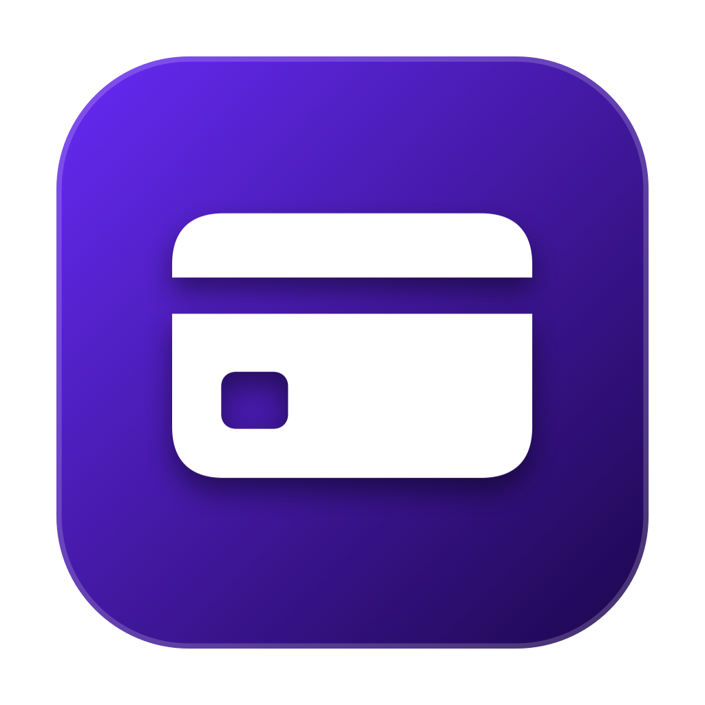

# AirCard Injector — iOS 26+ Fix for AirCard-iOS

<p align="center">
  
</p>

<p align="center">
  <b>The official fix to make <a href="https://github.com/Mak5er/AirCard-iOS">AirCard-iOS</a> work on iOS 26+.</b><br>
  Pairs your iPhone via USB, extracts valid pairing credentials, and inlines them into the AirCard IPA so you can customize Apple Wallet without Developer Mode pairing errors.
</p>

<p align="center">
  <a href="README_RU.md">🇷🇺 Инструкция на русском</a> •
  <a href="#how-it-works">How It Works</a> •
  <a href="#how-to-use">How to Use</a> •
  <a href="#credits">Credits</a>
</p>

---

## ⚠️ The Problem: Why AirCard-iOS Fails on iOS 26

[AirCard-iOS](https://github.com/Mak5er/AirCard-iOS) is an awesome app by [@Mak5er](https://github.com/Mak5er) that lets you change your Apple Wallet card skins without a jailbreak.

However, **if you are running iOS 26 or newer, AirCard-iOS simply will not pair**:
- The on-device pairing feature in Developer Mode (`Pair on This iPhone`) does not work on iOS 26.
- The internal service throws errors like `Connection reset by peer` or `TunnelFailurePairVerify`.
- Without a valid pairing file, the live card scanner fails and cards cannot be customized.

---

## 💡 The Fix

**AirCard Injector** is a standalone macOS tool that completely solves this problem:

1. **Pairs once via USB**: Connect your iPhone to your Mac and use the built-in pairing helper (`idevice_pair` by [@jkcoxson](https://github.com/jkcoxson)).
2. **Extracts pairing credentials**: Automatically captures the required certificates and keys.
3. **Injects into AirCard-iOS**: Takes any base `AirCard-iOS.ipa` and injects `pairingFile.plist` directly into its bundle.
4. **Ready to install**: Generates an `AirCard-Injected.ipa` that connects instantly through your local VPN (`LocalDevVPN` / `SideStore WireGuard`) with zero pairing errors!

---

## 🚀 How to Use

### Step 1. Get AirCard Injector
Download **`AirCardInjector.dmg`** from [**Releases**](https://github.com/merybist/AirCard-Injector/releases), open it, and drag the app to your `Applications` folder.

### Step 2. Pair iPhone via USB
1. Connect your iPhone to your Mac with a USB / Lightning / USB-C cable.
2. If your iPhone asks, tap **Trust This Computer** and enter your passcode.
3. Open **AirCard Injector** and click the blue button **Launch Key Generator (idevice_pair)**.
4. Complete the quick prompt. The app will automatically detect your new pairing file!

### Step 3. Select Base AirCard IPA
Under Step 2, select your base `AirCard-iOS.ipa` (you can also click *Download Latest Release from GitHub* to fetch the official build).

### Step 4. Inject & Sideload
1. Click **Inject Pairing & Generate IPA**.
2. Sideload the generated `AirCard-Injected.ipa` using **SideStore**, **LiveContainer**, **TrollStore**, or **AltStore**.
3. Turn on your loopback VPN (`LocalDevVPN` or SideStore WireGuard), open AirCard, and change your Wallet cards!

---

## 🛠️ Building from Source

```bash
git clone https://github.com/merybist/AirCard-Injector.git
cd AirCard-Injector
./scripts/build_dmg.sh
```
The compiled image will be located in `build/AirCardInjector.dmg`.

---

## 🤝 Credits

* **[@Mak5er](https://github.com/Mak5er)** — Creator of **[AirCard-iOS](https://github.com/Mak5er/AirCard-iOS)**.
* **[@jkcoxson](https://github.com/jkcoxson)** — Creator of **[idevice_pair](https://github.com/jkcoxson/idevice_pair)**.

---

## 📄 License

MIT License. See [LICENSE](LICENSE) for details.
